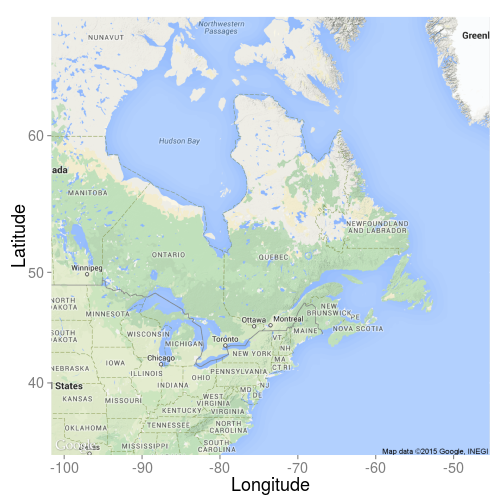
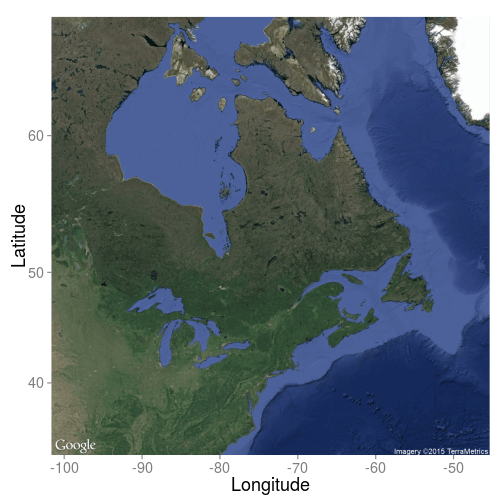
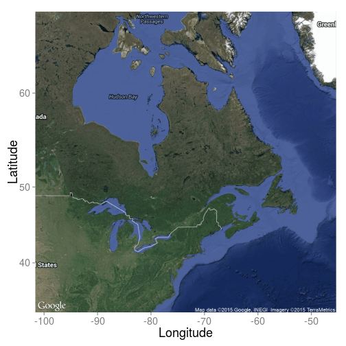
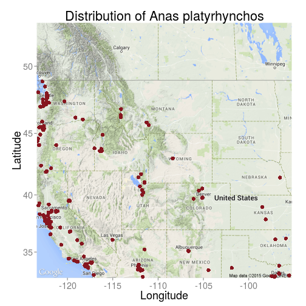

## Les données ouvertes et l'univers des APIs
**Ca peut vous simplifier la vie!**

</br>
Rencontre interlabs</br>
</br>

<span style="font-size:x-large">Par Steve Vissault et Isabelle Boulangeat </span>


---

### Les données ouvertes et les APIs, c'est quoi ?

> **Une donnée ouverte** est une donnée numérique d'origine publique ou privée.
> Elle est diffusée de manière structurée avec une **[licence ouverte](http://choosealicense.com/)** garantissant son libre accès.

> Une API web est une interface/programme permettant de retirer de l'information sur un serveur de données
> Ce type d'interface utilise les protocoles standard d'internet (HTTP).

---

### Objectif de la rencontre


**Partager et présenter des ressources disponibles via Internet, ou des programmes (R/Python)**

---

### Les base de données spatiales et climatiques

---

### Quelques base de données spatiales/climatiques

1. <a href="http://www.mern.gouv.qc.ca/territoire/portrait/portrait-donnees.jsp" target="_blank">La base de données cartographiques du Québec</a>
2. <a href="http://www.worldclim.org/" target="_blank">Worldclim</a>:Climat mondial à une résolution de 1 km^2
3. <a href="http://www.diva-gis.org/gdata" target="_blank">DivaGIS</a>: Shapefiles pour toutes les pays du monde
4. <a href="http://cfs.nrcan.gc.ca/projects/3/8" target="_blank">GCM/RCM Canada</a>: Les scénarios des CCs
5. <a href="http://freegisdata.rtwilson.com/#home" target="_blank">FreeGIS</a>: Regroupe un grand nombre de données spatiales

---

### Comment obtenir un fond de carte rapide?

 

---

### Obtenir un fond de carte rapide (API Google)


```r
library('ggmap')
theme_set(theme_grey(base_size = 18))
qmap("Quebec",zoom = 4, maptype = 'terrain',extent ="normal") +
  scale_x_continuous(expand=c(0,0)) + scale_y_continuous(expand=c(0,0))+
  xlab("Longitude") + ylab("Latitude")
```

 

---
### Obtenir un fond de carte rapide (API Google)


```r
library('ggmap')
theme_set(theme_grey(base_size = 18))
qmap("Quebec",zoom = 4, maptype = 'satellite',extent ="normal") +
  scale_x_continuous(expand=c(0,0)) + scale_y_continuous(expand=c(0,0))+
  xlab("Longitude") + ylab("Latitude")
```

 

---

### Obtenir un fond de carte rapide (API Google)


```r
library('ggmap')
theme_set(theme_grey(base_size = 18))
qmap("Quebec",zoom = 4, maptype = 'hybrid',extent ="normal") +
  scale_x_continuous(expand=c(0,0)) + scale_y_continuous(expand=c(0,0))+
  xlab("Longitude") + ylab("Latitude")
```

 

---

### Les bases de données biologiques

---

### Quelques exemples

1. GBIF
2. BISON
3. INAT
4. EBIRD
5. ECOENGINE

---

### Comment interroger ces bases de données rapidement ?

---

### ROpenSci, une solution

> They are creating R packages that allow access to data repositories that is already a familiar part of the workflow of many scientists

<a href="http://ropensci.org/packages/" target="_blank">Liste des librairies disponibles</a>

Site internet: [http://ropensci.org/](http://ropensci.org/)

---

### Un exemple


```r
require('spocc')
ecoengine_data <- occ(query = 'Anas platyrhynchos', from = 'ebird')
mapggplot(ecoengine_data)
```

 

---

### Un exemple


```r
require('spocc')
spnames <- c('Ursus americanus')
out <- occ(query = spnames, from = 'gbif', gbifopts = list(hasCoordinate = TRUE))
head(out)
```

```
## $gbif
## Species [Ursus americanus (500)] 
## First 10 rows of [Ursus_americanus]
## 
##                name  longitude latitude prov              issues
## 1  Ursus americanus -103.29468 29.23322 gbif cdround,cudc,gass84
## 2  Ursus americanus -118.14681 34.20990 gbif cdround,cudc,gass84
## 3  Ursus americanus  -72.52534 43.73511 gbif cdround,cudc,gass84
## 4  Ursus americanus -103.28908 29.28284 gbif cdround,cudc,gass84
## 5  Ursus americanus -107.70675 33.11070 gbif             cdround
## 6  Ursus americanus -103.31536 29.27444 gbif cdround,cudc,gass84
## 7  Ursus americanus  -72.46131 44.34088 gbif cdround,cudc,gass84
## 8  Ursus americanus -119.16081 34.56844 gbif cdround,cudc,gass84
## 9  Ursus americanus -117.46038 50.09019 gbif cdround,cudc,gass84
## 10 Ursus americanus -120.16434 39.51185 gbif cdround,cudc,gass84
## ..              ...        ...      ...  ...                 ...
## Variables not shown: key (int), datasetKey (chr), publishingOrgKey (chr),
##      publishingCountry (chr), protocol (chr), lastCrawled (chr),
##      lastParsed (chr), extensions (chr), basisOfRecord (chr), taxonKey
##      (int), kingdomKey (int), phylumKey (int), classKey (int), orderKey
##      (int), familyKey (int), genusKey (int), speciesKey (int),
##      scientificName (chr), kingdom (chr), phylum (chr), order (chr),
##      family (chr), genus (chr), species (chr), genericName (chr),
##      specificEpithet (chr), taxonRank (chr), dateIdentified (chr), year
##      (int), month (int), day (int), eventDate (chr), modified (chr),
##      lastInterpreted (chr), references (chr), identifiers (chr), facts
##      (chr), relations (chr), geodeticDatum (chr), class (chr), countryCode
##      (chr), country (chr), gbifID (chr), verbatimEventDate (chr),
##      institutionCode (chr), datasetName (chr), catalogNumber (chr),
##      recordedBy (chr), rights (chr), occurrenceDetails (chr), rightsHolder
##      (chr), eventTime (chr), occurrenceID (chr), identifier (chr), taxonID
##      (chr), collectionCode (chr), identificationID (chr),
##      infraspecificEpithet (chr), verbatimLocality (chr), occurrenceRemarks
##      (chr), lifeStage (chr), elevation (dbl), elevationAccuracy (dbl),
##      continent (chr), stateProvince (chr), georeferencedDate (chr),
##      institutionID (chr), higherGeography (chr), type (chr), identifiedBy
##      (chr), georeferenceSources (chr), identificationVerificationStatus
##      (chr), samplingProtocol (chr), endDayOfYear (chr),
##      otherCatalogNumbers (chr), preparations (chr),
##      georeferenceVerificationStatus (chr), nomenclaturalCode (chr),
##      individualID (chr), higherClassification (chr), locationAccordingTo
##      (chr), previousIdentifications (chr), verbatimCoordinateSystem (chr),
##      georeferenceProtocol (chr), identificationQualifier (chr),
##      accessRights (chr), dynamicProperties (chr), county (chr), locality
##      (chr), language (chr), georeferencedBy (chr), informationWithheld
##      (chr), sex (chr), locationRemarks (chr), waterBody (chr), island
##      (chr), collectionID (chr), depth (dbl), depthAccuracy (dbl)
## 
## $bison
## Species [Ursus americanus (0)] 
## First 10 rows of [Ursus_americanus]
## 
## 
## $inat
## Species [Ursus americanus (0)] 
## First 10 rows of [Ursus_americanus]
## 
## 
## $ebird
## Species [Ursus americanus (0)] 
## First 10 rows of [Ursus_americanus]
## 
## 
## $ecoengine
## Species [Ursus americanus (0)] 
## First 10 rows of [Ursus_americanus]
## 
## 
## $antweb
## Species [Ursus americanus (0)] 
## First 10 rows of [Ursus_americanus]
```

---

### Si on veut pas utiliser R ?

On peut retirer les données directement des sites en lignes

**ou**

Utiliser des logiciels comme EcoData Retriever

---

### Les base de données taxonomiques

---

### Les base de données taxonomiques

**Quelques exemples**

1. ITIS: International
2. VASCAN: Canada

---


### Comment résoudre des problèmes de nomenclature ?

---

### Le package Taxize

Chercher des correspondances dans les bases de données taxonomiques:


```r
require('taxize')
temp <- gnr_resolve(names = c("Helianthos annus", "Homo saapiens"))
head( temp$results )
```

```
##     submitted_name         matched_name data_source_title score
## 1 Helianthos annus     Helianthus annus               EOL  0.75
## 2 Helianthos annus  Helianthus annus L.               EOL  0.75
## 3 Helianthos annus     Helianthus annus     uBio NameBank  0.75
## 4 Helianthos annus Helianthus annuus L. Catalogue of Life  0.75
## 5 Helianthos annus Helianthus annuus L.              ITIS  0.75
## 6 Helianthos annus    Helianthus annuus              NCBI  0.75
```

---

### Le package Taxize

Corriger le nom latin:


```r
require('taxize')
mynames <- c("Helianthus annuus", "Pinus contort", "Poa anua", "Abis magnifica",
    "Rosa california", "Festuca arundinace", "Sorbus occidentalos","Madia sateva")
tnrs(query = mynames, source = "iPlant_TNRS")[ , -c(5:7)]
```

```
##         submittedname        acceptedname    sourceid score
## 1 Sorbus occidentalos Sorbus occidentalis iPlant_TNRS  0.99
## 2  Festuca arundinace Festuca arundinacea iPlant_TNRS  0.99
## 3      Abis magnifica     Abies magnifica iPlant_TNRS  0.96
## 4       Pinus contort      Pinus contorta iPlant_TNRS  0.98
## 5            Poa anua           Poa annua iPlant_TNRS  0.96
## 6        Madia sateva        Madia sativa iPlant_TNRS  0.97
## 7   Helianthus annuus   Helianthus annuus iPlant_TNRS     1
## 8     Rosa california    Rosa californica iPlant_TNRS  0.99
```

---

### Le package Taxize

Obtenir la classification complète:


```r
require('taxize')
specieslist <- c("Abies procera","Pinus contorta")
classification(specieslist, db = 'itis')
```

```
## $`Abies procera`
##               name          rank     id
## 1          Plantae       Kingdom 202422
## 2    Viridiplantae    Subkingdom 954898
## 3     Streptophyta  Infrakingdom 846494
## 4      Embryophyta Superdivision 954900
## 5     Tracheophyta      Division 846496
## 6  Spermatophytina   Subdivision 846504
## 7        Pinopsida         Class 500009
## 8          Pinidae      Subclass 954916
## 9          Pinales         Order 500028
## 10        Pinaceae        Family  18030
## 11           Abies         Genus  18031
## 12   Abies procera       Species 181835
## 
## $`Pinus contorta`
##               name          rank     id
## 1          Plantae       Kingdom 202422
## 2    Viridiplantae    Subkingdom 954898
## 3     Streptophyta  Infrakingdom 846494
## 4      Embryophyta Superdivision 954900
## 5     Tracheophyta      Division 846496
## 6  Spermatophytina   Subdivision 846504
## 7        Pinopsida         Class 500009
## 8          Pinidae      Subclass 954916
## 9          Pinales         Order 500028
## 10        Pinaceae        Family  18030
## 11           Pinus         Genus  18035
## 12  Pinus contorta       Species 183327
## 
## attr(,"class")
## [1] "classification"
## attr(,"db")
## [1] "itis"
```
